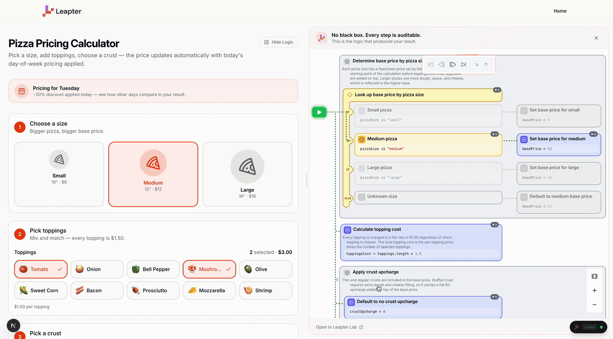
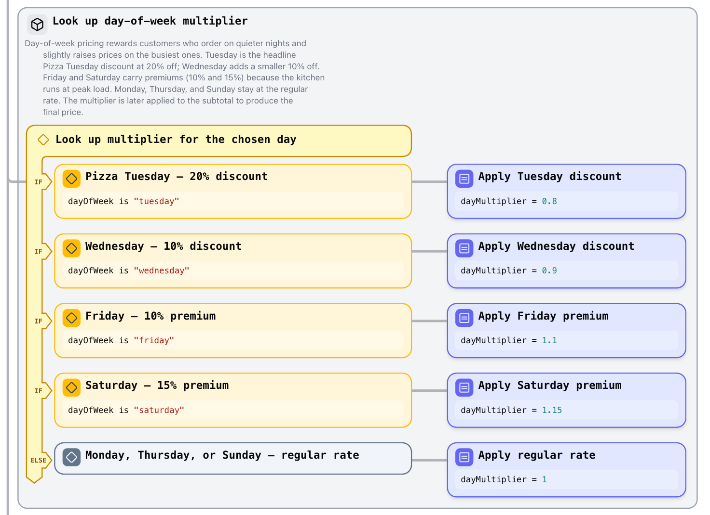
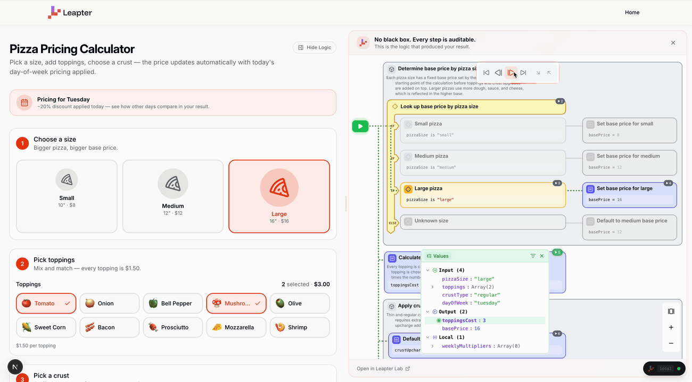
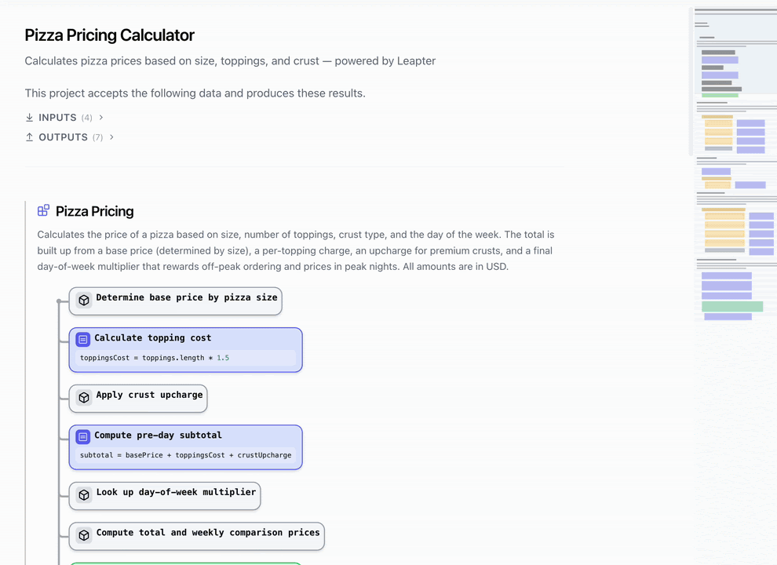

# Literate Visual Programming for AI-Generated Business Logic

Coding agents are getting very good at building apps. The risky part is what happens to the business logic inside those apps.

Pricing rules, eligibility checks, reimbursement policies, compliance gates, and scoring formulas often start with a rule owner outside engineering. When an agent turns those rules into ordinary application code, the app may work, but the implementation becomes hard for that rule owner to inspect.

This starter shows a different pattern:

> Let the agent build the app. Keep the business logic in an inspectable, executable visual program.

In this repo, business logic lives in **Veritas** files: text-based logic files that sit in Git, validate locally, execute deterministically, and render as editable Leapter **Blueprints**. A Blueprint is not a screenshot of code. It is the program.



## What You Can Try

The included example is a pizza pricing calculator. Change the size, toppings, crust, or day of week, then click **Show Logic** to see the exact logic path that produced the result.

```bash
git clone https://github.com/leapter/leapter-starter-nextjs.git my-app
cd my-app
pnpm install
```

Start the local demo:

```bash
pnpm dev
```

Then open the example app in your browser:

```text
http://localhost:4000
```

No Leapter SaaS account is required for this local demo.

To use an agent workflow, open the repo with Claude Code, Codex, or another local coding agent that reads project instructions.

With Claude Code:

```bash
claude
```

Then type:

```text
hello
```

The agent will check your setup, start the app, show the included example, and guide you toward creating your own app from requirements.

## Why This Exists

For a UI, verification is direct. You can look at the generated app and say, "move that button" or "that layout is wrong."

Business logic is different. A pricing rule can pass a few sample outputs while still being wrong in an edge case. A compliance exception can be implemented backwards. An eligibility threshold can be off by one. The only reliable way to verify the implementation is to inspect the logic.

Today that usually means reading code.

Leapter changes the artifact. Instead of hiding business logic in TypeScript, Python, prompts, or opaque workflow nodes, the logic lives in a side-effect-free program that can be:

- generated by AI
- read as a structured specification
- rendered as a visual program
- edited in a diagram editor with AI support
- executed in production
- tested with ordinary inputs and outputs
- traced step by step
- versioned and reviewed like software
- compared with visual diffs
- managed in shared projects
- hosted as API or MCP tools when you want Leapter to run it for you
- exported or run through multiple runtime paths

The goal is not to replace code. The goal is to give business-critical logic a better review interface.

## The Core Idea

This starter separates the app into two parts:

| Layer | Lives In | Purpose |
|---|---|---|
| App shell | `web/` | UI, layout, forms, charts, interaction |
| Business logic | `leapter/` | Veritas logic files that compile into executable Blueprints |

The rule is strict:

> Business logic does not go in React or TypeScript. It goes in Veritas.

That means the UI can be rewritten, restyled, or regenerated without burying the pricing calculation, scoring model, or policy decision inside invisible application code.

## A Veritas File Looks Like This

The pizza example lives at:

```text
leapter/logic/pizza-pricing/pizza-pricing.logic.vts
```

Excerpt:

```veritas
section "Look up day-of-week multiplier" {
    """
    Day-of-week pricing rewards customers who order on quieter nights and
    slightly raises prices on the busiest ones. Tuesday is the headline
    Pizza Tuesday discount at 20% off; Wednesday adds a smaller 10% off.
    Friday and Saturday carry premiums because the kitchen runs at peak load.
    """
    //* Look up multiplier for the chosen day
    choose {
        //* Pizza Tuesday - 20% discount
        if (dayOfWeek is "tuesday") {
            //* Apply Tuesday discount
            dayMultiplier = 0.80;
        }
        //* Friday - 10% premium
        if (dayOfWeek is "friday") {
            //* Apply Friday premium
            dayMultiplier = 1.10;
        }
        //* Monday, Thursday, or Sunday - regular rate
        else {
            //* Apply regular rate
            dayMultiplier = 1.0;
        }
    }
}
```

The prose states intent. The Veritas logic defines behavior. When those disagree, that mismatch is a review signal.

Rendered as a Leapter Blueprint, the same logic becomes an executable diagram:



## See The Logic That Ran

The app includes an in-browser logic inspector. Click **Show Logic** to open it.

When the form calculates a result, the inspector shows:

- the visual Blueprint
- the execution trace
- the input values
- the output values
- the active path through the logic

This makes the result inspectable from the inside. You are not just seeing that the app returned `$17.60`; you can see why.



## Runtime And Lock-In

This starter executes blueprints in the browser during development:

```bash
pnpm dev
```

That starts two processes side-by-side:

- a tiny `leapter convert --watch` watcher that compiles `.vts` blueprints
  to JSON whenever you change them
- the Next.js app on `localhost:4000`

The larger Leapter model is runtime-flexible: the same logic can be used through different paths depending on what the application needs.

- local runtime during development
- browser-embedded runtime
- server runtime
- API / OpenAPI
- MCP tools for agents
- JavaScript or Python export

For this starter, no Leapter SaaS account is required to validate and execute the included Blueprint. Pushing the Blueprint to Leapter Lab is optional and gives you the web-based diagram editor, AI-assisted editing, shared project workspace, visual review tools, and hosted runtime options. Login is only needed for account-bound capabilities such as API keys, hosted MCP/API execution, and production trace retention.

## Project Structure

```text
leapter-starter-nextjs/
├── requirements/          Business rules and specs, used as input for the agent
├── leapter/               Veritas project: executable business logic
│   ├── leapter.project
│   └── logic/
│       └── pizza-pricing/
│           └── pizza-pricing.logic.vts
├── web/                   Next.js app shell and UI
├── packages/
│   └── leapter-client/    Runtime API client
├── AGENTS.md              Agent instructions for Codex-style tools
├── .claude/               Claude skills for Leapter and Veritas authoring
└── .leapter-tools/        Bundled Leapter CLI
```

## Build Your Own App

You can start from a sentence:

```text
Build a travel expense reimbursement calculator.
Employees enter trip type, country, meal expenses, hotel nights, and receipts.
The app should calculate reimbursable amount, flag policy violations, and show
which policy rules were applied.
```

Or drop requirements into `requirements/`:

```text
requirements/travel-expenses/requirements.md
requirements/discount-approval/policy.xlsx
requirements/credit-precheck/rules.pdf
```

Then ask Claude:

```text
Read the requirements and build the app. Keep all business logic in Leapter.
```

The agent should:

1. turn the rules into Veritas files under `leapter/`
2. validate the logic locally
3. create a tailored app UI under `web/`
4. wire the UI to the Blueprint runtime
5. preserve the logic inspector so results remain inspectable

## Useful Commands

Install dependencies:

```bash
pnpm install
```

Start the runtime and browser app:

```bash
pnpm dev
```

Then open the UI:

```text
http://localhost:4000/calculator
```

Validate Veritas logic:

```bash
pnpm validate
```

Run the pizza pricing logic directly from the command line as an alternative test path:

```bash
cd leapter
../.leapter-tools/cli/leapter runtime run \
  --model pizza-pricing \
  --input '{"pizzaSize":"large","toppings":["pepperoni","mushrooms"],"crustType":"stuffed","dayOfWeek":"tuesday"}' \
  --format json
```

Open VS Code with the Leapter Blueprint viewer:

```bash
pnpm vscode
```

This installs the bundled VS Code extension from `.leapter-tools/leapter-blueprint-viewer.vsix` and opens the workspace. Open a `.logic.vts` file to see the visual Blueprint representation next to the text source.



Push Blueprints to Leapter Lab:

```bash
pnpm push
```

Use this when you want the same Veritas logic in Leapter Lab's web editor. There you can inspect and edit the diagram, use AI-assisted editing, review visual diffs, collaborate in a shared project, and optionally enable hosted API/MCP execution.

## What This Is Good For

Leapter Blueprints are side-effect-free functions. They take inputs, apply logic, and return outputs.

Good fits:

- pricing and discount logic
- quote calculators
- eligibility checks
- policy validation
- reimbursement rules
- underwriting-style scoring
- compliance gates
- deterministic agent tools

Poor fits:

- full web apps
- data pipelines
- long-running workflows
- database mutation logic
- network orchestration
- UI rendering

The boundary is intentional. Side-effect-free logic is easier to inspect, test, trace, and review.

## How This Differs From Other Approaches

The literate programming part matters. Veritas sections do not just group code; they carry the intent behind the rule in the same artifact as the executable logic. That is the difference between "the system checks this threshold" and "the system checks this threshold because this policy exception exists."

Visual programming makes the structure inspectable. Literate programming keeps the reason attached to the structure. AI makes that richer artifact practical to generate and maintain.

| Approach | What happens to business logic |
|---|---|
| Generated app code | Logic works, but often disappears into ordinary source files |
| Prompt-only agent | Logic is flexible, but runtime behavior may vary |
| Low-code workflow | Logic is visual, but often tied to a platform runtime and workflow model, with limited literate context |
| Documentation | Intent is readable, but does not execute |
| Rules engine | Logic can be deterministic, but the authoring/review artifact is usually not built for AI-assisted literate visual editing, trace replay, and visual diffs |
| Leapter / Veritas | Logic is text in Git, visual in the editor, executable at runtime, traceable after each run, reviewable with visual diffs, and editable with AI support |

## Current State

This is an early starter, built to test the concept, the workflow, and the artifact itself: business logic as a literate visual program that AI can generate and humans can inspect.

What is working here:

- local Veritas validation
- local Blueprint execution
- a full pizza pricing example
- in-browser logic trace inspection
- AI-assisted Blueprint edits
- AI-assisted test creation
- visual diffs
- agent instructions for Claude Code and Codex-style tools
- VS Code Blueprint viewer setup

What is still evolving:

- the best UX for bringing literate specifications, visual diagrams, AI edits, tests, and review comments together in the web editor
- the exact open-source shape of Veritas, the viewer, and runtime pieces
- more example projects beyond the starter
- smoother support across coding agents

## Help Shape This

We are looking for feedback from people who have business-critical logic that should not be hidden inside generated app code.

Especially useful:

- teams using AI coding agents for internal tools
- teams with pricing, eligibility, reimbursement, compliance, or scoring rules
- people who own rules but do not want to review implementation code
- developers who have had to translate business rules back and forth between stakeholders and source code
- people with opinions on what our open-source strategy should be

Open an issue, start a discussion, or tell us what breaks.

## Telemetry

Nothing leaves your machine automatically. There is no analytics SDK,
no ping on launch, no background reporting.

When you run Claude Code inside the starter, a hook script at
[`.claude/hooks/telemetry.mjs`](.claude/hooks/telemetry.mjs) writes a
local log of your prompts and the tool calls Claude makes to
`.leapter/telemetry.jsonl` (gitignored). The log is plain JSON Lines you
can `cat` any time, and you can clear it by deleting the file.

A dev-only **Share feedback** page (top header in `pnpm dev`) lets you
send feedback to us. It previews the literal payload before you click
send: the exact bytes, no hidden fields. Attaching the session log and
the project snapshot are independent opt-in checkboxes; both default
off, and what you see in the preview is what gets sent.

The hook script never records: your username, hostname, IP address,
environment variables, or anything outside the project directory.
Absolute paths are collapsed to basenames. Assistant responses are not
captured; only your prompts and what Claude did with them.

## Learn More

- [Leapter](https://leapter.com)
- [Leapter Docs](https://docs.leapter.com/get-started/what-is-leapter)
- [Veritas authoring guide](.claude/skills/leapter-veritas/SKILL.md)
- [Claude project instructions](CLAUDE.md)

## License

The starter app code, examples, documentation, requirements, and agent
instructions are MIT-licensed.

The bundled Leapter CLI/converter, browser runtime, and VS Code Blueprint
viewer are proprietary Leapter beta tooling. They are included so the local
demo can validate, view, convert, and execute the example logic without a
Leapter SaaS account.

You own the business logic artifacts you create with this starter. The included
pizza-pricing Veritas file is an example you can copy, modify, and use under
the starter's MIT license.

We are still deciding the long-term open-source shape of Veritas, local
runtime, and viewer tooling. For now, please do not describe the whole starter
or Leapter platform as open source.

See [LICENSE](LICENSE), [.leapter-tools/LICENSE](.leapter-tools/LICENSE), and
[packages/runtime-browser/LICENSE](packages/runtime-browser/LICENSE) for the
full license notices.
